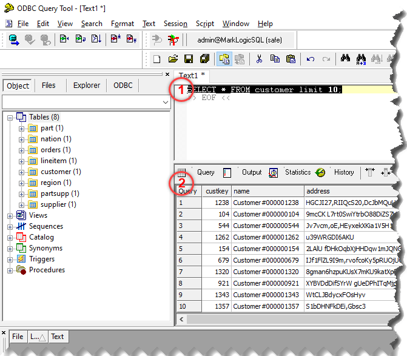

# MarkLogic via ODBC
Intended to demonstrate using MarkLogic's ODBC driver.

This is a ml-gradle project.  While MarkLogic is required, MarkLogic Data Hub is not. 

## Set Up

### Prerequisites

Git, Java, and MarkLogic.

Developed with Git 1.8.3.1, Zulu JDK 11.43 (11.0.9.1) 64-bit, and MarkLogic 10.0-5.1.

_Should you be interested in scripting the set up of these prerequisites and PowerShell is at your disposal, pick up [where I left off](./src/scripts)._ 

### Steps

1. Clone this repo and checkout the desired branch.
1. Review `gradle.properties`, and override in `gradle-local.properties` as needed or desired.
1. Run `./gradlew mlDeploy`.  Deployment takes care of the dependencies required to load the sample data, including database configuration, a MLCP transform function, and the TDE templates.
1. Run `./gradlew loadData`.  Seeks out specific files within [./data/dbgen](./data/dbgen), adds a header row, then loads into MarkLogic using [MLCP](https://api.marklogic.com/guide/mlcp/intro) such that the data aligns with the TDE templates.
1. Install MarkLogic's ODBC driver.
    * Download from https://developer.marklogic.com/products/odbc/
    * Installation directions are at https://docs.marklogic.com/guide/sql/odbc-driver 
    
### Confirmation

At this point, you should be able to connect from your ODBC client and pull back some sample data.

A quick option on Windows is to download and use the likes of [ODBC Query Tester](https://sourceforge.net/projects/odbcquerytool/).  Connect to the DNS that should have been configured when setting up MarkLogic's ODBC driver.  Once connected, run a simple query such as `select * from customer limit 10;`.

I found a couple aspects nuanced in the ODBC Query Tool.  To run the query, _select it_ before pressing `F10` (1).  And to see the returned data, _make sure the window is large enough_ to display the data (2).

Should you experience issues with that tool or another, run the same query in MarkLogic's Query Console.  If that console returns data, the issue is with the ODBC client or driver set up.

## Sample Data and Entity Configuration

Sample data generated by [DBGen](https://github.com/gregrahn/tpch-kit) is included within [./data/dbgen](./data/dbgen).  Outside of this project's abilities, one may optionally regenerate it, which one may wish to do in order to have a larger data set.  So long as DBGen produces the same tables and columns, one only need to replace the files within [./data/dbgen](./data/dbgen) and run `./gradlew loadData` to get that data set into MarkLogic.  Note existing files are not automatically deleted; however, the URIs incorporate row numbers and may therefore lead to replacing files.

If there's a new table or the columns of a table change, a few things will need to be adjusted:

1. [./build.gradle](./build.gradle): The `dbgenConfig` variable needs to list the tables and their columns.
1. [./data/entity-services](./data/entity-services): An Entity Services (ES) model definition must be defined for and aligned with each table.
1. If there's a new or modified ES model definition (in [./data/entity-services](./data/entity-services)), use the `mlGenerateModelArtifacts` Gradle task to generate related resources, then `mlDeploy` to get those resources into MarkLogic.  If you experience issues with this step, consider checking out ml-gradle's [Entity Services example project](https://github.com/marklogic-community/ml-gradle/tree/dev/examples/entity-services-project).
